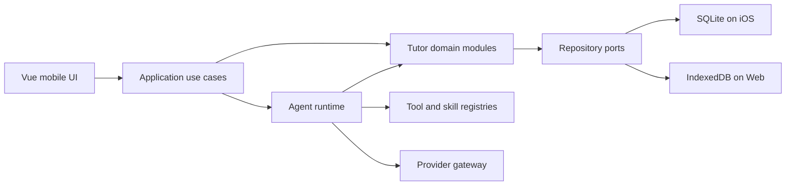

# Civil AI

[](https://github.com/zhangl1001/civil-ai/actions/workflows/ci.yml)
[](LICENSE)
[](web/package.json)
[](ios/App/App.xcodeproj)

Civil AI is a local-first AI tutor for China's civil-service examinations and a reusable reference implementation for on-device agent workflows.

中文定位：面向个人完整备考周期的本地优先 AI 公考私教。系统围绕建档、计划、学习、练习、批改、错因诊断、间隔复习和能力变化建立持续闭环，而不是只提供聊天或批量生题。

> Civil AI is under active development. Questions, model output, predictions, and learning advice are educational aids, not official examination guidance.

Civil AI is not affiliated with an examination authority, question setter, or training provider. The repository contains only original demonstration material and does not bundle or license third-party question banks. Review [`LEGAL_AND_CONTENT_POLICY.md`](LEGAL_AND_CONTENT_POLICY.md) before importing, retrieving, storing, or sharing external content.

## Why this project exists

Most study products optimize for question volume. Civil AI explores a different model: use deterministic learning evidence and an AI tutor together to decide what a candidate should learn, practise, review, or revisit next.

The application is designed around three principles:

- **Local-first ownership:** structured learning data stays on the device by default.
- **Evidence before autonomy:** the agent can make teaching decisions, while deterministic services own scores, state transitions, validation, and persistence.
- **Provider neutrality:** model providers are adapters, not business dependencies.

## Current capabilities

- Vue 3 and TypeScript mobile UI with a Capacitor iOS shell.
- SQLite on iOS and IndexedDB as the browser development adapter.
- Anthropic and OpenAI-compatible provider gateway with bounded retries and cancellation.
- Agent runtime with tools, skills, checkpoints, task state, recovery, and controlled concurrency.
- Candidate profile, target score, daily plan, practice, grading, error diagnosis, wrong-book review, essay and interview workflows.
- Structured content generation with Markdown rendering and asynchronous enrichment.
- Local data export, import, and deletion controls.

## Architecture



The repository separates business modules from reusable capabilities:

| Area | Purpose | Reusable boundary |
| --- | --- | --- |
| `web/src/modules/agent` | Agent runs, leases, checkpoints, cancellation, recovery | Provider-independent run lifecycle |
| `web/src/capabilities/ai-runtime` | Provider adapters, prompt compilation, parsing | Anthropic/OpenAI-compatible gateway |
| `web/src/modules/content` | Structured generation and enrichment | Block-based content generation pipeline |
| `web/src/modules/planning` | Daily and cycle planning | Deterministic planning policies |
| `web/src/modules/mastery` | Mastery state and review priority | Evidence-based capability model |
| `web/src/modules/evidence` | Learning observations and outcomes | Append-oriented evidence contracts |
| `web/src/capabilities/database` | Database abstraction and migrations | SQLite/IndexedDB adapter boundary |
| `web/src/capabilities/content-rendering` | Safe Markdown and structured blocks | Shared rendering pipeline |
| `web/src/capabilities/web-research` | Search, fetch, normalization, network policy | Provider-neutral research tools |

Start with the [architecture index](docs/architecture-index.md), then read:

- [Architecture constitution](docs/architecture-constitution.md)
- [Core business architecture](docs/core-business-architecture.md)
- [AI service architecture](docs/ai-service-architecture.md)
- [Provider-neutral agent runtime ADR](docs/adr-001-provider-neutral-agent-runtime.md)
- [Pi agent loop ADR](docs/adr-002-pi-agent-core-loop-engine.md)
- [Public roadmap](ROADMAP.md)

## Quick start

### Requirements

- Node.js 20.19+ or 22.12+
- npm 10+
- macOS and Xcode 16+ for iOS builds

```bash
git clone https://github.com/zhangl1001/civil-ai.git
cd civil-ai
npm ci
npm --prefix web ci
npm --prefix web run dev
```

Open the local URL printed by Vite. Configure model credentials only in the application settings or local environment. Never commit credentials to source, Issues, logs, or screenshots.

## Verification

Run the complete repository gate:

```bash
npm test
```

Focused checks are also available:

```bash
npm run check:architecture
npm run check:agent-runtime
npm run check:generation-workflow
npm run check:web-research
```

The CI workflow installs locked dependencies, audits production dependencies, and runs the same verification gate on pull requests to `main`.

## iOS build and installation

```bash
npm run ios:sync
open ios/App/App.xcodeproj
```

In Xcode, select your own Apple Developer Team and a unique Bundle Identifier before running on a device. The project always packages the current Vue build.

Public releases include a browser-ready Web bundle. An iOS IPA is not published because a development-signed IPA is limited to registered devices and contains provisioning metadata. Contributors can build an installable IPA with their own signing identity by following the [iOS installation guide](docs/upgrade-v1.2.0.md#ios-installation).

## Data and model boundaries

- API keys are stored on the user's device and must not enter the repository.
- Model, research, voice, image, and document requests may be sent directly to the provider selected by the user.
- Imported learning material and conversation records are stored locally by default.
- Web research rejects localhost, private-network targets, credential-bearing URLs, and unsafe redirects.
- AI-generated material remains identifiable and must not impersonate official or human-authored content.

See [`PRIVACY.md`](PRIVACY.md), [`SECURITY.md`](SECURITY.md), and [`LEGAL_AND_CONTENT_POLICY.md`](LEGAL_AND_CONTENT_POLICY.md) for complete boundaries.

## Releases and upgrades

- [GitHub Releases](https://github.com/zhangl1001/civil-ai/releases)
- [Changelog](CHANGELOG.md)
- [v1.2.0 upgrade guide](docs/upgrade-v1.2.0.md)

## Contributing

Issues and pull requests are welcome. Read [`CONTRIBUTING.md`](CONTRIBUTING.md), [`CODE_OF_CONDUCT.md`](CODE_OF_CONDUCT.md), and [`MAINTAINERS.md`](MAINTAINERS.md) before contributing. Security findings must be reported privately as described in [`SECURITY.md`](SECURITY.md).

## License

Civil AI is available under the [ISC License](LICENSE).
