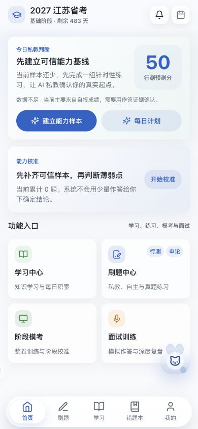
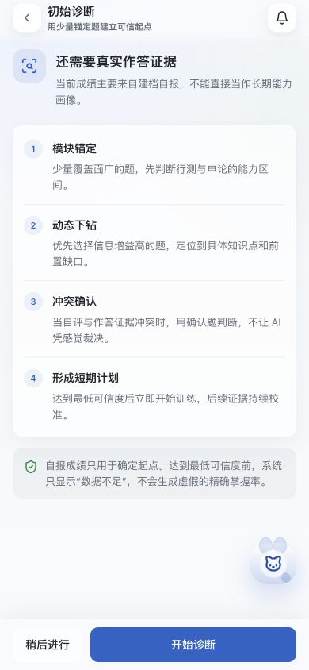
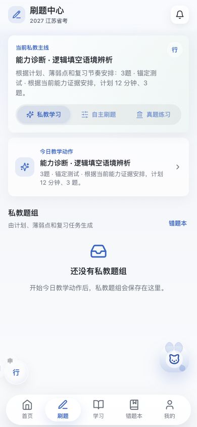
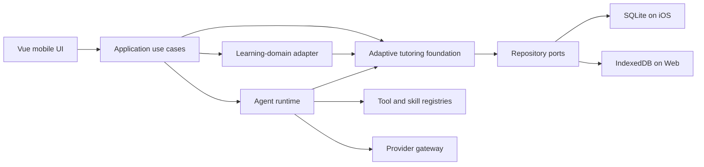

# Civil AI

> A local-first adaptive education Agent foundation, validated through an end-to-end tutoring reference application.

[](https://github.com/zhangl1001/civil-ai/actions/workflows/ci.yml)
[](LICENSE)
[](web/package.json)
[](ios/App/App.xcodeproj)

Civil AI is a reusable, local-first foundation for building adaptive education Agents on iOS and Web. It separates provider-neutral Agent execution, learner evidence, mastery projection, planning, structured content, persistence, and safety boundaries from domain-specific curricula and teaching policies.

The included Chinese civil-service examination application is the current end-to-end reference adapter. It validates the foundation through a real learning loop, but it does not define the scope of the foundation.

中文定位：Civil AI 是面向 iOS 与 Web 的本地优先自适应教育 Agent 基础实现。Agent 运行、学习证据、掌握度、计划、结构化内容、持久化和安全边界属于可复用基础层；中国公考应用是当前完整跑通的领域适配与参考实现，不是基础层的能力边界。

> Civil AI is under active development. Questions, model output, predictions, and learning advice are educational aids, not official examination guidance.

Civil AI is not affiliated with an examination authority, question setter, or training provider. The repository contains only original demonstration material and does not bundle or license third-party question banks. Review [`LEGAL_AND_CONTENT_POLICY.md`](LEGAL_AND_CONTENT_POLICY.md) before importing, retrieving, storing, or sharing external content.

## Verified, not asserted

Every claim below is enforced by the build gate on each push and reproducible locally with `npm test`, before you read a line of prose.

| | Enforced state |
| --- | --- |
| **Build gate** | 39 repository checks, then `vue-tsc`, then the production bundle — any failure blocks the build |
| **Executable checks** | 32 of those 39 boot the real modules through Vite's SSR loader and assert on observed behaviour, not on mocks |
| **Portability** | 2 bundled examination packages; the second is installed headlessly and driven end to end, so curricula, subjects, grading, routing, and prompts are data rather than code |
| **Schema integrity** | 42 numbered migrations, each checksummed and re-verified against the applied history on startup |
| **Type discipline** | explicit `any`, `@ts-ignore`, and `@ts-nocheck` rejected outright across 609 TypeScript and Vue source files |
| **Size discipline** | every source file carries a line budget — 600 by default, 16 recorded legacy allowances — so an oversized file must be decomposed, never annotated |

Full detail in [what the gate enforces](#what-the-gate-enforces).

## Who this repository is for

This repository is intended for maintainers and builders who need to:

- build an education Agent that acts on durable learning evidence instead of chat history alone;
- keep model providers replaceable while preserving deterministic validation and persistence;
- run recoverable Agent and content workflows on mobile or local-first clients;
- add a learning domain through explicit curricula, capability graphs, rubrics, and teaching policies;
- study a production-shaped reference application rather than an abstraction-only framework.

Users interested only in the civil-service exam product can use the reference application. Contributors extending the foundation should work through its public ports, registries, schemas, and composition roots instead of importing exam-specific policies into reusable modules.

## Why this project exists

Many learning products optimize content delivery or question volume without maintaining a reliable model of what the learner understands, forgets, or can transfer. Civil AI explores a different model: deterministic learning evidence and an adaptive tutoring Agent jointly decide what a learner should study, practise, review, or revisit next.

The application is designed around three principles:

- **Local-first ownership:** structured learning data stays on the device by default.
- **Evidence before autonomy:** the agent can make teaching decisions, while deterministic services own scores, state transitions, validation, and persistence.
- **Provider neutrality:** model providers are adapters, not business dependencies.

**Where this is going.** The target is a foundation where adding a learning domain is a data exercise rather than an engineering project: a new curriculum, capability graph, rubric, and teaching policy, with no reusable module edited. The second examination package was the first real test of that boundary, and it held — subjects, modules, score bands, partial-credit rules, routing, and prompt resolution all moved as data, and the one place that had hardcoded a civil-service assumption failed the build instead of shipping. Examinations are the proving ground, not the ceiling: the loop underneath them — observe, project mastery, plan, teach, re-observe — is what any serious adaptive tutor needs. Some contracts still carry exam-domain identifiers and are being extracted. The direction is not in doubt; what makes it credible is that each step of it is enforced by a check rather than announced in a document.

## Foundation and reference application

The repository deliberately separates reusable education-Agent mechanisms from domain-specific teaching content. It is not an abstraction-only framework: the civil-service exam adapter exercises the contracts through a complete learning loop and exposes where runtime, evidence, planning, content, and recovery boundaries must work in practice.

| Layer | Includes | Current maturity |
| --- | --- | --- |
| Portable Agent runtime | Agent loop, provider gateway, Tool/Skill registries, context assembly, cancellation, recovery, rendering, and Web research | Reused through explicit application ports and covered by focused conformance checks |
| Adaptive tutoring foundation | Learner evidence, mastery projection, planning, structured educational content, review scheduling, and local persistence | Implemented end to end; selected contracts still carry exam-domain identifiers and require further extraction |
| Learning-domain adapter | Capability graph, curriculum, content policies, assessment roles, rubrics, and teaching strategies | Explicit versioned contracts loaded through registries, fixtures, and composition roots |
| Civil-service reference application | Aptitude, essay, interview, exam-cycle, candidate, and mobile workflows | Current production-shaped validation domain for the layers above |

The architecture is designed for reuse, but the repository does not claim that every module is already a standalone domain-neutral package. A second examination package (teacher recruitment) is bundled and exercised in CI, which validates that curricula, subjects, grading rules, answer formats, routing, and prompts are genuinely data rather than code. Both packages are still question-driven study against a scored threshold, so portability across learning domains remains unvalidated.

## Foundation capabilities

- Provider-neutral Agent runtime with tools, skills, checkpoints, leases, cancellation, recovery, and controlled concurrency.
- Evidence-oriented learner state, mastery projection, review priority, and adaptive planning contracts.
- Structured educational-content generation, block validation, safe Markdown rendering, and asynchronous enrichment.
- Versioned prompts, schemas, curricula, grading policies, and learning-domain registries.
- SQLite and IndexedDB repository adapters with migration, recovery, export, import, and deletion boundaries.
- Web research, document input, and native capabilities behind explicit policy-controlled ports.
- Vue 3 and TypeScript mobile UI with a Capacitor iOS reference shell.

## Reference application capabilities

The civil-service adapter currently demonstrates candidate profiles, target scores, daily plans, objective and subjective practice, grading, error diagnosis, wrong-answer review, spaced review, essay workflows, interview training, and capability reporting. These workflows validate the foundation; their exam-specific policies remain isolated in the reference domain.

## Reference application preview

These screenshots use a synthetic learner profile and maintainer-authored demonstration data. The Chinese mobile interface is the current reference adapter; the reusable contracts are documented in English throughout the repository.

| Evidence-driven tutor home | Trustworthy baseline diagnosis | Adaptive practice orchestration |
| --- | --- | --- |
|  |  |  |
| The primary action changes with learner evidence instead of presenting a static feature dashboard. | Self-reported scores remain untrusted until objective evidence establishes a usable baseline. | Tutor, self-directed, and reference-question paths share one task and question-set foundation. |

## Architecture



The repository separates reusable capabilities from learning-domain policies and reference-application workflows:

| Area | Purpose | Reusable boundary |
| --- | --- | --- |
| `web/src/modules/agent` | Agent runs, leases, checkpoints, cancellation, recovery | Provider-independent run lifecycle |
| `web/src/capabilities/ai-runtime` | Provider adapters, prompt compilation, parsing | Anthropic/OpenAI-compatible gateway |
| `web/src/modules/content` | Structured generation and enrichment | Block-based content generation pipeline |
| `web/src/modules/planning` | Daily and cycle planning | Deterministic planning policies |
| `web/src/modules/mastery` | Mastery state and review priority | Evidence-based capability model |
| `web/src/modules/evidence` | Learning observations and outcomes | Append-oriented evidence contracts |
| `web/src/capabilities/database` | Database abstraction and migrations | SQLite/IndexedDB adapter boundary |
| `web/src/capabilities/content-rendering` | Safe Markdown and structured blocks | Shared rendering pipeline |
| `web/src/capabilities/web-research` | Search, fetch, normalization, network policy | Provider-neutral research tools |

Start with the [architecture index](docs/architecture-index.md), then read:

- [Architecture constitution](docs/architecture-constitution.md)
- [Core business architecture](docs/core-business-architecture.md)
- [AI service architecture](docs/ai-service-architecture.md)
- [Provider-neutral agent runtime ADR](docs/adr-001-provider-neutral-agent-runtime.md)
- [Pi agent loop ADR](docs/adr-002-pi-agent-core-loop-engine.md)
- [Public roadmap](ROADMAP.md)

## Quick start

### Requirements

- Node.js 20.19+ or 22.12+
- npm 10+
- macOS and Xcode 16+ for iOS builds

```bash
git clone https://github.com/zhangl1001/civil-ai.git
cd civil-ai
npm ci
npm --prefix web ci
npm --prefix web run dev
```

Open the local URL printed by Vite. Configure model credentials only in the application settings or local environment. Never commit credentials to source, Issues, logs, or screenshots.

## Verification

Run the complete repository gate:

```bash
npm test
```

Focused checks are also available:

```bash
npm run check:architecture
npm run check:agent-runtime
npm run check:generation-workflow
npm run check:web-research
```

The CI workflow installs locked dependencies, audits production dependencies, and runs the same verification gate on pull requests to `main`.

### What the gate enforces

The application build chain is the real gate: **39 repository checks**, then `vue-tsc` type checking, then the production bundle. Thirty-two of those checks load the actual modules through Vite's SSR loader and assert on observed behaviour rather than on mocks, so each one is an executable claim about the system and a regression fails the build instead of reaching a release.

- **Portability across examination domains.** A second, unrelated examination package — teacher recruitment, with different subjects, modules, score bands, a different partial-credit rule, and a subjective written subject — is installed headlessly and driven through curriculum activation, grading, planning, capability routing, and prompt resolution. This check found a real regression: content generation had hardcoded the civil-service subject code. It demonstrates portability across examinations; portability across learning domains remains unvalidated.
- **Schema integrity.** 42 numbered SQL migrations, each recorded with a checksum in `schema_migrations` and re-verified against the applied history on startup. An edited migration is rejected rather than silently reapplied.
- **Structural budgets.** Explicit `any`, `@ts-ignore`, and `@ts-nocheck` are rejected outright. Every source file carries a line budget — 600 by default, with 16 files holding a recorded legacy allowance — so an oversized file must be decomposed instead of annotated. The 609 TypeScript and Vue source files are all covered.
- **Boundary enforcement.** Module public surfaces, layering direction, prompt and schema and curriculum versioning, agent-run recovery, and the provider gateway each have a dedicated check, so crossing an architectural boundary is a build failure rather than a review comment.

## iOS build and installation

```bash
npm run ios:sync
open ios/App/App.xcodeproj
```

In Xcode, select your own Apple Developer Team and a unique Bundle Identifier before running on a device. The project always packages the current Vue build.

Public releases include a browser-ready Web bundle. An iOS IPA is not published because a development-signed IPA is limited to registered devices and contains provisioning metadata. Contributors can build an installable IPA with their own signing identity by following the [iOS installation guide](docs/upgrade-v1.2.0.md#ios-installation).

## Data and model boundaries

- API keys are stored on the user's device and must not enter the repository.
- Model, research, voice, image, and document requests may be sent directly to the provider selected by the user.
- Imported learning material and conversation records are stored locally by default.
- Web research rejects localhost, private-network targets, credential-bearing URLs, and unsafe redirects.
- AI-generated material remains identifiable and must not impersonate official or human-authored content.

See [`PRIVACY.md`](PRIVACY.md), [`SECURITY.md`](SECURITY.md), and [`LEGAL_AND_CONTENT_POLICY.md`](LEGAL_AND_CONTENT_POLICY.md) for complete boundaries.

## Releases and upgrades

- [GitHub Releases](https://github.com/zhangl1001/civil-ai/releases)
- [Changelog](CHANGELOG.md)
- [v1.2.0 upgrade guide](docs/upgrade-v1.2.0.md)

## Contributing

Issues and pull requests are welcome. Read [`CONTRIBUTING.md`](CONTRIBUTING.md), [`CODE_OF_CONDUCT.md`](CODE_OF_CONDUCT.md), and [`MAINTAINERS.md`](MAINTAINERS.md) before contributing. Security findings must be reported privately as described in [`SECURITY.md`](SECURITY.md).

## License

Civil AI is available under the [MIT License](LICENSE).
